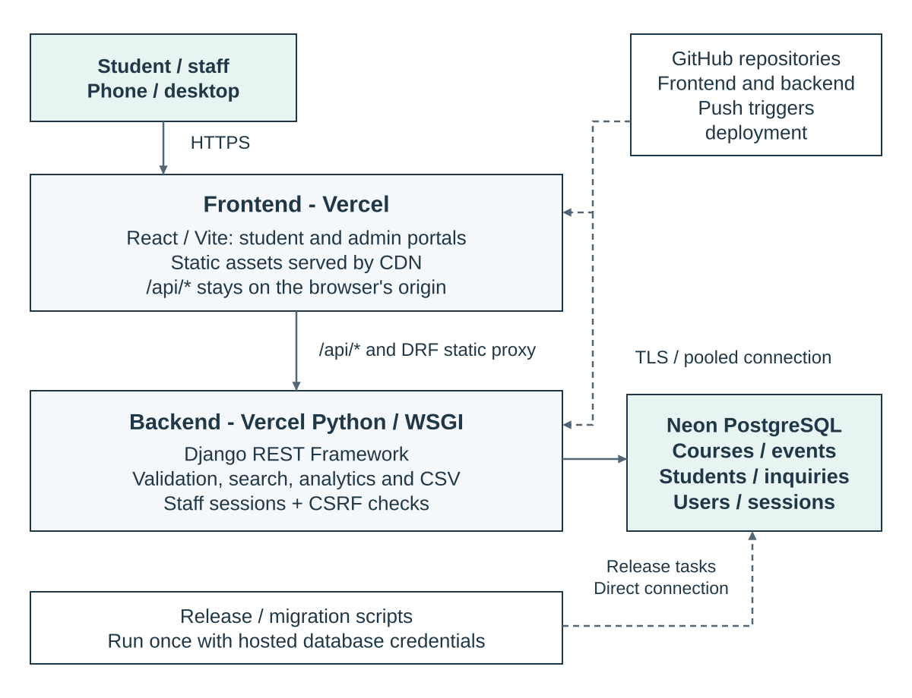
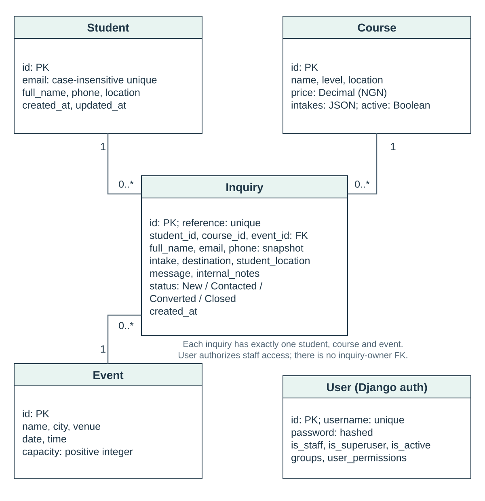
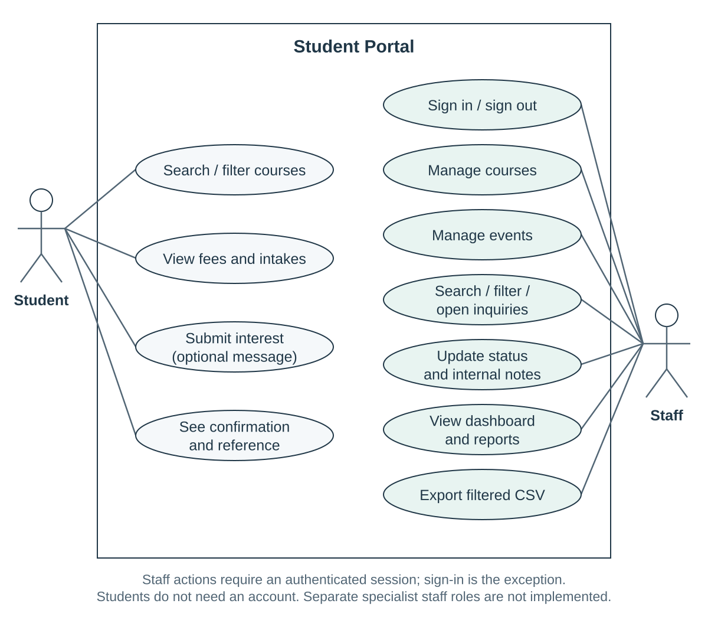
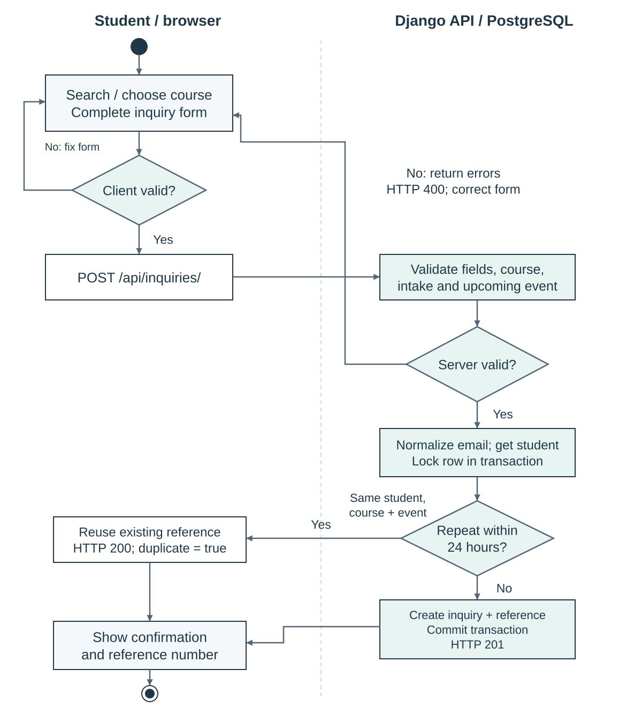

# Student Portal — architecture

TGM Education · 8 October 2026

## Live project

- [Student portal](https://tgm-student-portal-frontend.vercel.app/)
- [Admin portal](https://tgm-student-portal-frontend.vercel.app/admin/)
- [Backend](https://tgm-student-portal-backend.vercel.app/)
- [API root](https://tgm-student-portal-backend.vercel.app/api/)

Use **/api/** to browse the backend; the backend's bare root is not a separate landing page. Public resources: [courses](https://tgm-student-portal-backend.vercel.app/api/courses/), [events](https://tgm-student-portal-backend.vercel.app/api/events/) and the [inquiry submission endpoint](https://tgm-student-portal-backend.vercel.app/api/inquiries/). [Browsable API sign-in](https://tgm-student-portal-backend.vercel.app/api/auth/login/) supports staff-only endpoints.

The verified migration snapshot has 20 courses, 4 events, 243 students, 243 inquiries and 2 active staff accounts. Local records were merged into Neon without duplicating the demo references. Password hashes and permissions were preserved; staff use their existing credentials. Sessions were not copied. The local database remains unchanged.

## Deployment

The frontend and backend are separate Vercel projects. React/Vite serves the two portals; Django REST Framework handles validation, search, inquiries and analytics. Frontend rewrites forward /api/* and DRF static assets to the backend while the browser keeps one origin. Staff sessions therefore work without cross-site cookie exceptions.

Django runs through config.wsgi.application. Runtime database traffic uses Neon's pooled TLS connection, with persistent Django connections and server-side cursors disabled on Vercel. Release/transfer jobs use hosted credentials; transfers can use the direct endpoint. Browsers never receive database credentials.

The repositories are [backend](https://github.com/EdetDavid/tgm_education_student_portal) and [frontend](https://github.com/EdetDavid/tgm_student_portal_frontend). Each standalone repository uses an empty Vercel Root Directory. Run migrations deliberately with scripts/release.py, not inside requests. Keep schema changes compatible with the previous deployment so code can be rolled back safely. Separate staging databases and automated CI checks are follow-ups, not features claimed by this build.

## Data model

Each inquiry belongs to exactly one Student, Course and Event. Course selection is independent of study choice: the student selects a course, programme type, intake, destination country and destination city separately. Protected foreign keys keep referenced records from being deleted accidentally. Tuition and revenue estimates use NGN.

Student email is unique regardless of case. Inquiry reference is unique. Django User stores hashed passwords and staff flags; it is not the student contact record. There is no per-inquiry staff owner or audit-user foreign key in this build.

## Use cases

Students search courses, choose a programme type and study destination, choose an event and submit interest without an account. Staff sign in to manage courses/events, search inquiries, update status and notes, read reports and export the filtered view. Current staff sessions expose Super Admin or Admin; the onboarding panel appears after each successful login. Counsellor and Student are defined as planned roles for a fuller authenticated user portal, not as separate permissions in this build.

Reports include inquiry totals and trends, course demand, intake, location, destination, event capacity, status and potential revenue. Bar/pie charts respond to the same filters as the inquiry table and CSV. Potential revenue means matching inquiry count × current tuition, not income already collected.

## Submission flow

Both sides validate the form. The server checks the active course, available intake and upcoming event. It normalizes email and locks the student row inside a PostgreSQL transaction before checking for a repeat. The same student/course/event within 24 hours gets the existing reference; another course/event or a later submission creates a new inquiry. Field errors return HTTP 400, a new inquiry returns 201, and a duplicate returns 200 with its original reference.

## Search and security

Search runs in PostgreSQL, not just in the browser. Staff searches accept partial names, emails, phones and references. A shared, validated query builder drives filters, pagination, dashboard totals and export. Pagination has an ID tie-breaker.

B-tree indexes cover foreign keys, recent records and common filters. The duplicate check has a student/course/event/date index. pg_trgm GIN indexes on UPPER(search fields) support Django's case-insensitive substring queries. Add further indexes only when measured query plans justify their storage and write cost.

Every admin endpoint checks an active staff session; writes require CSRF. Production uses secure cookies, explicit hosts/origins and private/no-store API responses. ORM queries avoid interpolated SQL, React escapes ordinary text, and CSV export handles formula-like values. Public endpoints do not list student inquiries.

Before handling real exhibition data, add login/submission rate limits, staff MFA/SSO, an audit trail and monitoring without contact details in logs. Agree retention and restore targets. Support staff, catalogue manager, analyst and administrator groups are a possible extension, not separate permissions currently implemented.

## Recovery and checks

The local-to-Neon transfer took a private pg_dump backup first, remapped foreign keys and verified the merge before committing. Existing cloud records were not overwritten; matching demo timestamps stayed as they were online. Backups contain contact details/password hashes and are excluded from Git and Vercel uploads. Restore into a separate database and test recovery before real event use.

Production checks passed for catalog access, submission, duplicate references, CSRF-protected login, staff sessions and dashboard access. Temporary smoke-test records were removed. Recheck the full student/admin flow after a release; review Django deployment warnings rather than assuming a successful build proves production readiness.

The diagram sources are in docs/diagrams: Mermaid for architecture, classes and activity; PlantUML for use cases. SVGs are embedded here, with PNGs used in the Word document. PowerShell rendering scripts are in docs.

References: [Vercel Django](https://vercel.com/docs/frameworks/full-stack/django), [Django deployment checklist](https://docs.djangoproject.com/en/5.2/howto/deployment/checklist/), [PostgreSQL trigram indexes](https://www.postgresql.org/docs/17/pgtrgm.html#PGTRGM-INDEX).
